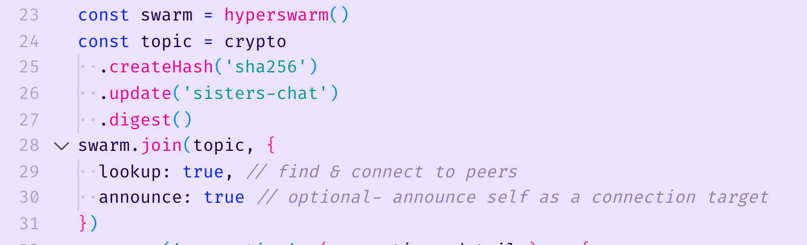
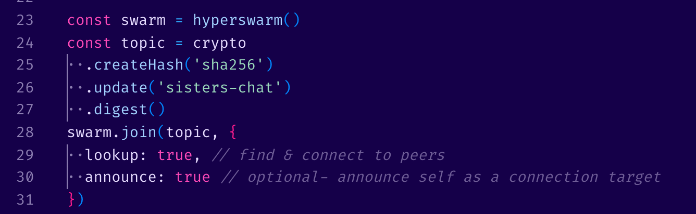
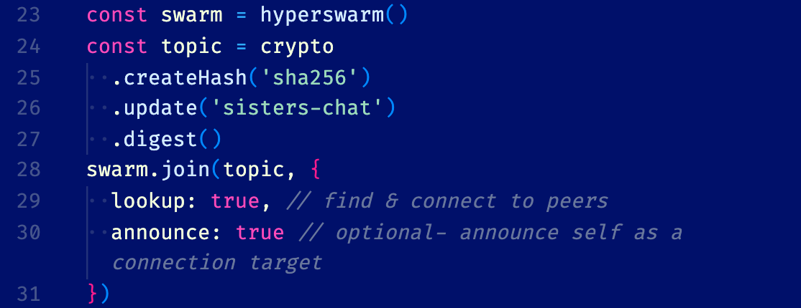
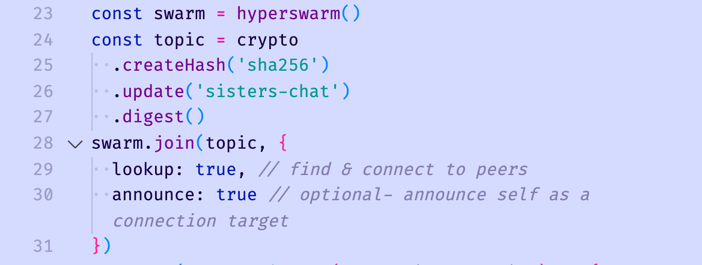

# Colors for Underwater Friends

## themes for vscode/vscodium






## Installation

1. `git clone https://github.com/radio-alice/anemone-colors`
2. `mv anemone-colors ~/.vscode/extensions` or `mv anemone-colors ~/.vscode-oss/extensions` if you're using vscodium
3. Settings > Workbench: color theme > Anemones || Sea Urchin || Vaquita || Manatee

### bracket-pair settings that I use:

(add to settings.json)

```
"bracket-pair-colorizer-2.colors": [
    "#0088FF",
    "#FF1C8D",
    "#00E3E2",
    "#ffdd5d",
    "#f14100"
  ]
```

if you want to tweak these themes, you can customize [here](https://themer.dev/?colors.dark.shade0=%23150049&colors.dark.shade7=%23e6dcff&colors.dark.accent0=%23ff009c&colors.dark.accent1=%23ffa685&colors.dark.accent2=%23fff3c5&colors.dark.accent3=%239bdabb&colors.dark.accent4=%23d2ebff&colors.dark.accent5=%23ffc8f5&colors.dark.accent6=%232eacff&colors.dark.accent7=%23ff4ab9&colors.light.shade7=%23150049&colors.light.shade0=%23eae2ff&colors.light.accent0=%23f14100&colors.light.accent1=%2300bce1&colors.light.accent5=%23007699&colors.light.accent4=%23750091&colors.light.accent6=%23ed0090&colors.light.accent3=%23009892&colors.light.accent2=%230024f3&colors.light.accent7=%230018b1&activeColorSet=dark&calculateIntermediaryShades.dark=true) and [here](https://themer.dev/?colors.dark.shade0=%2300106a&colors.dark.shade7=%23f3ffdc&colors.dark.accent0=%23ff009c&colors.dark.accent1=%23ffa685&colors.dark.accent2=%23ffdd5d&colors.dark.accent3=%239bdabb&colors.dark.accent4=%23d2ebff&colors.dark.accent5=%23ffc8f5&colors.dark.accent6=%232eacff&colors.dark.accent7=%23ff4ab9&colors.light.shade7=%23150049&colors.light.shade0=%23d5dbff&colors.light.accent0=%23f14100&colors.light.accent1=%2300bce1&colors.light.accent5=%23007699&colors.light.accent4=%23750091&colors.light.accent6=%23ed0090&colors.light.accent3=%23009892&colors.light.accent2=%230024f3&colors.light.accent7=%230018b1&activeColorSet=dark&calculateIntermediaryShades.dark=true)

generated by the [VS Code template](https://github.com/mjswensen/themer/tree/master/cli/packages/themer-vscode) for [themer](https://github.com/mjswensen/themer)
